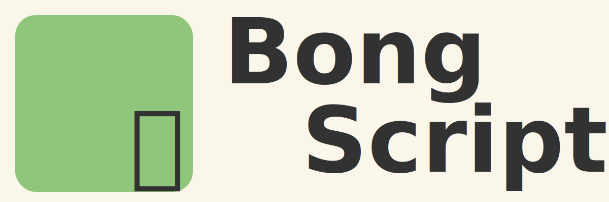

# BongScript

**BongScript** is a primitive, esoteric, interpreted, toy programming language that uses Bengali inspired syntax. It's designed for learning and experimentation, with support for variables, conditionals, loops, arithmetic operations, and basic printing — all written in a syntax that feels native to Bengali speakers.

---

## ✨ Features

- Bengali-flavored syntax like:
  - `eta holo a = 10;` → variable declaration
  - `lekho ("Hello");` → print statement
  - `jodi (a > b) { ... }` → if condition
  - `nahole { ... }` → else block
  - `nahole jodi { ... }` → else if block
  - `jotokhon (a != 0) { ... }` → while loop
- Basic arithmetic (`+`, `-`, `*`, `/`)
- Logical operators (`==`, `!=`, `>`, `<`)
- AST-based interpreter
- Simple tokenizer and parser
- Entirely written in **Python**

---

## 🚀 Getting Started

### 1. Clone the repo
```bash
git clone https://github.com/banik000/BongScript.git
cd BongScript
```

### 2. Run a BongScript program
Write your own program in **program.bong** and run as:
```bash
python main.py program.bong
```
Run any of the demo programs in examples folder as:
```bash
python main.py examples/hello_world.bong
```

## 📜 BongScript Syntax

### 1. Program Block
All BongScript programs must be enclosed within:
```
kaj shuru

// Your Program logic

kaj shesh
```

### 2. Print Statements
Basic Hello World program:
```
kaj shuru

lekho ("Hello World");

kaj shesh
```
Output:
```
Hello World
```

### 3. Variable Declarations
Variables are declared using **eta holo**. All statements should end with ";".
```
kaj shuru

eta holo a = 10;
eta holo b = 40;
eta holo c = 10.67;

eta holo s1 = "Apple";
eta holo s2 = "Orange";

lekho (a + b);
lekho (a + b + c);
lekho (s1 + s2);

kaj shesh
```
Output:
```
50
60.67      
AppleOrange
```
### 4. If-Else statements
An If statement is reprsented by **jodi** and else by **nahole**. If Else is represented by **nahole jodi**.

Following is a program to compare two numbers:
```
kaj shuru

eta holo a = 10;
eta holo b = 30;

jodi (a == b)
{
    lekho("Equal");
}
nahole jodi (a > b)
{
    lekho("Greater");
}
nahole
{
    lekho ("Smaller");
}

kaj shesh
```
Output:
```
Smaller
```

### 5. While loops
While loops are represented by **jotokhon**.

Following is a program to print numbers from 1 to 5:
```
kaj shuru

eta holo a = 1;

jotokhon (a != 6)
{
    lekho (a);
    a = a + 1;
}

kaj shesh
```
Output:
```
1
2
3
4
5
```

### 6. Adding comments
Single-line and Multi-line comments can be added using the keyword **montobbo**.

Following is an example:
```
kaj shuru

montobbo This is a single-line comment;

montobbo 
This is a
multi-line
comment;

kaj shesh
```

## ⚒️ Requirements
* Python 3.7+

No external dependencies required.


## 🥺 To Do
This project is under active development as of May 2025. Following features to be implemented:

* Methods
* Arrays
* Switch case
* Break and Continue statements
* Type Casting
* Compound Assignment operators
* More types of loops
* User Input 
* Error handling
* Interactive REPL mode

## 👨‍💻 Author
Made with ❤️ by Soumyajit Banik.

Made with ❤️ for post-modernist Bengali intellectuals.

